# Green Thumb
Green Thumb is an app that lets users log notes and watering dates on their houseplants so that they can track when they need to water the plant next. Green Thumb helps make sure your house plants stay happy! 

### Working Prototype

View Node working prototype here: [Green Thumb](https://node-capstone-plant-app.herokuapp.com/) 

## Site Map: MVP 

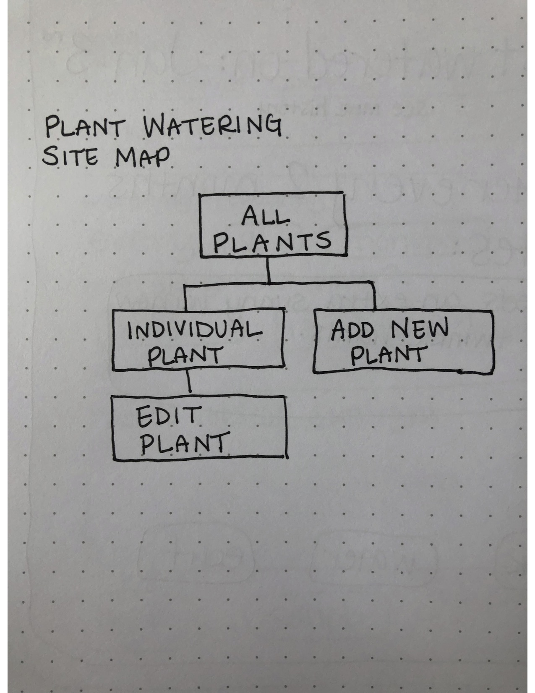

## UX & User Stories: MVP

**All Plants Page** 

As a user, I want to be able to view all the plants I have added so that I can select a plant to view.

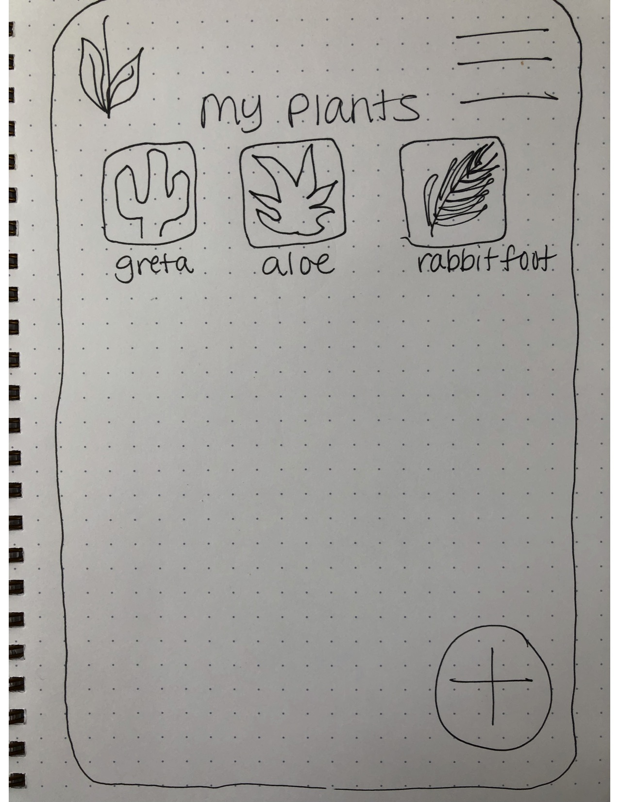

**Add New Plant Page**

As a user, I want to be able to add a new plant so that I can track its watering history and notes.

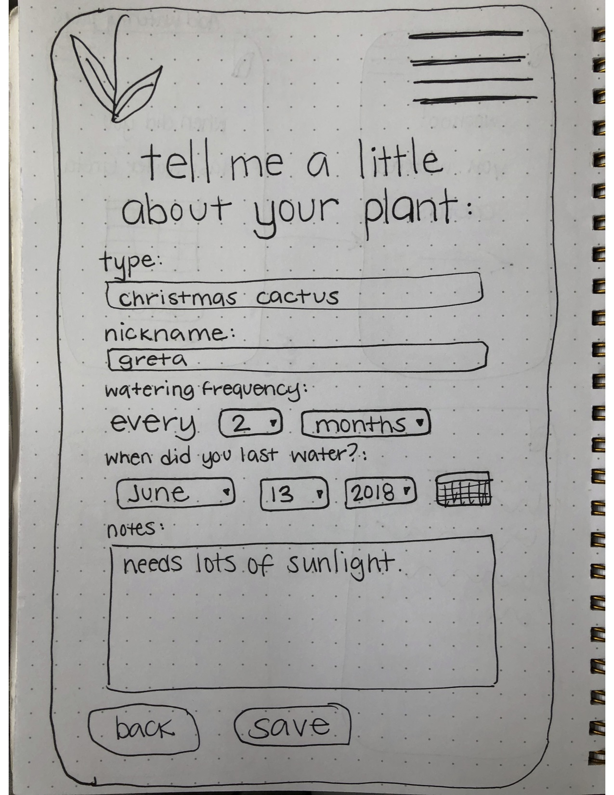

**Individual Plant Page**

As a user, I want to be able to view an individual plant so I can see its watering history.

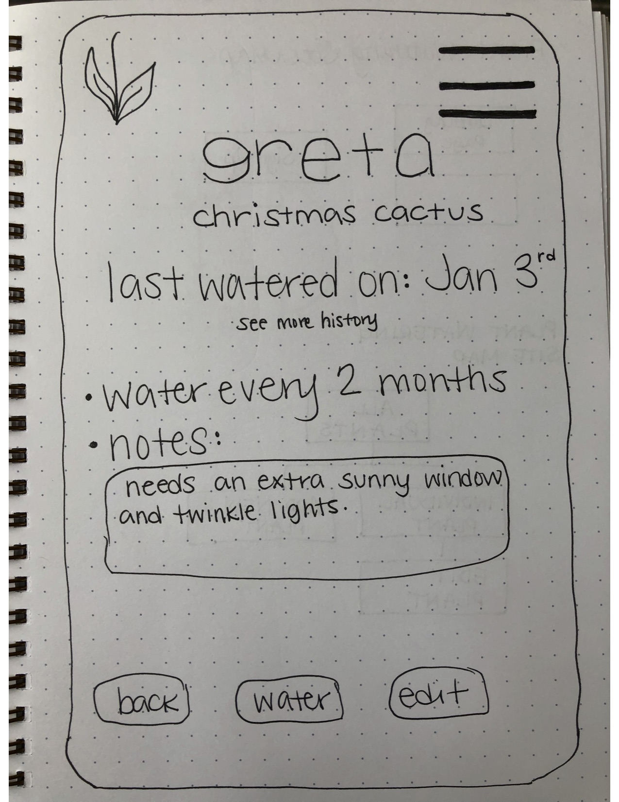

**Edit Plant Page**

As a user, I want to be able to edit an individual plant so that I can add watering dates or notes.

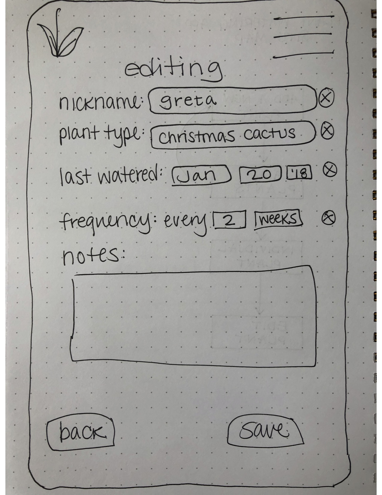

## Designs

**Landing Page** 

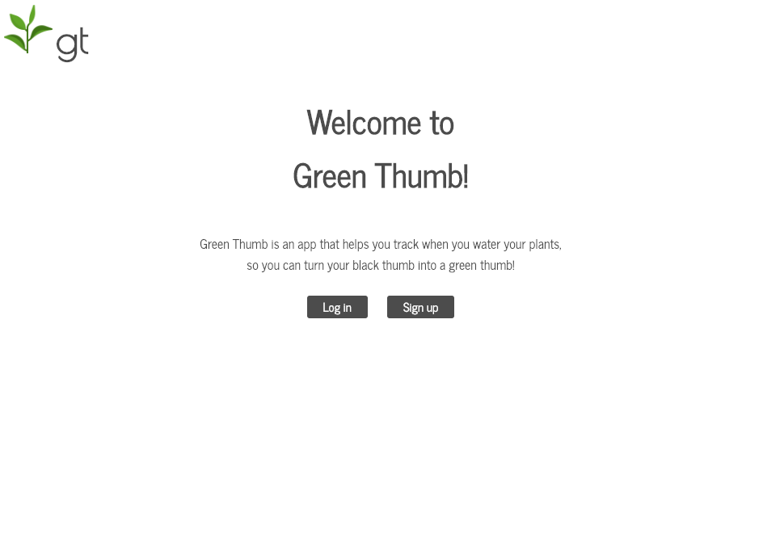

**Signup Page** 

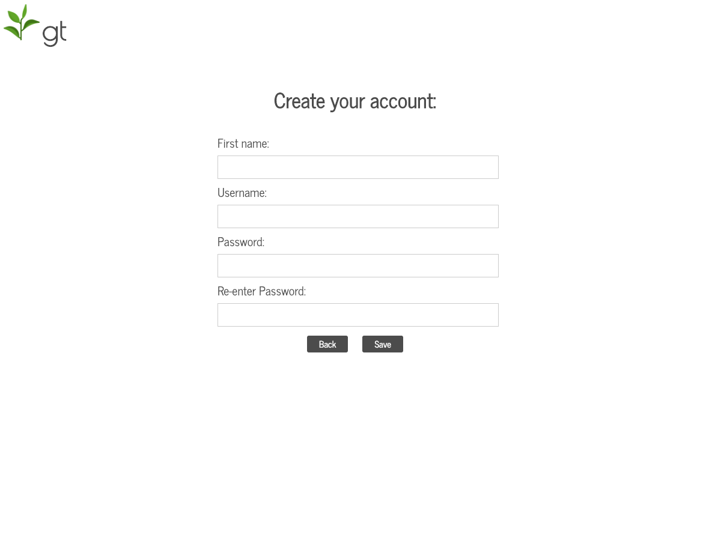

**All Plants Page** 

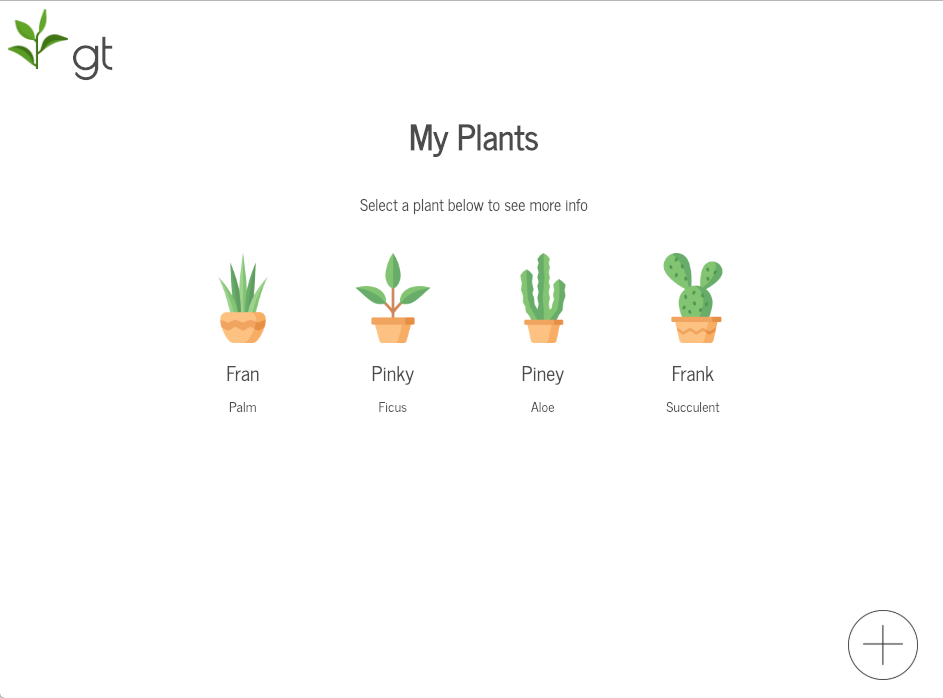

**Add New Plant Page**

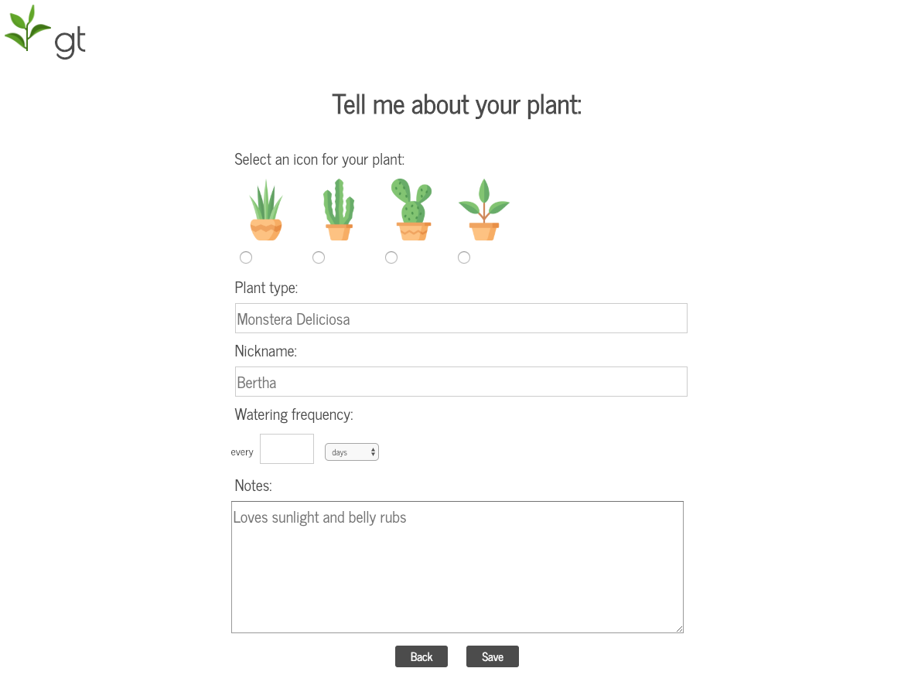

**Individual Plant Page**

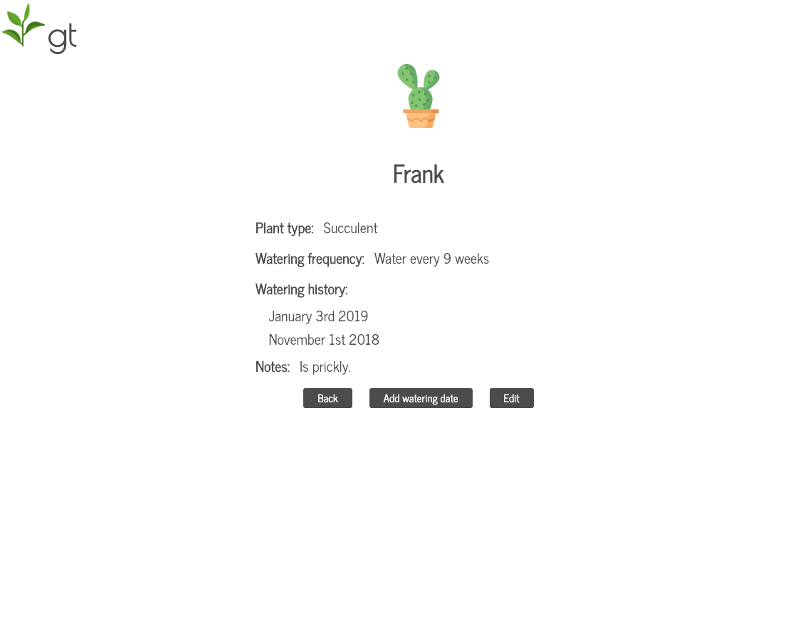

**Edit Plant Page**

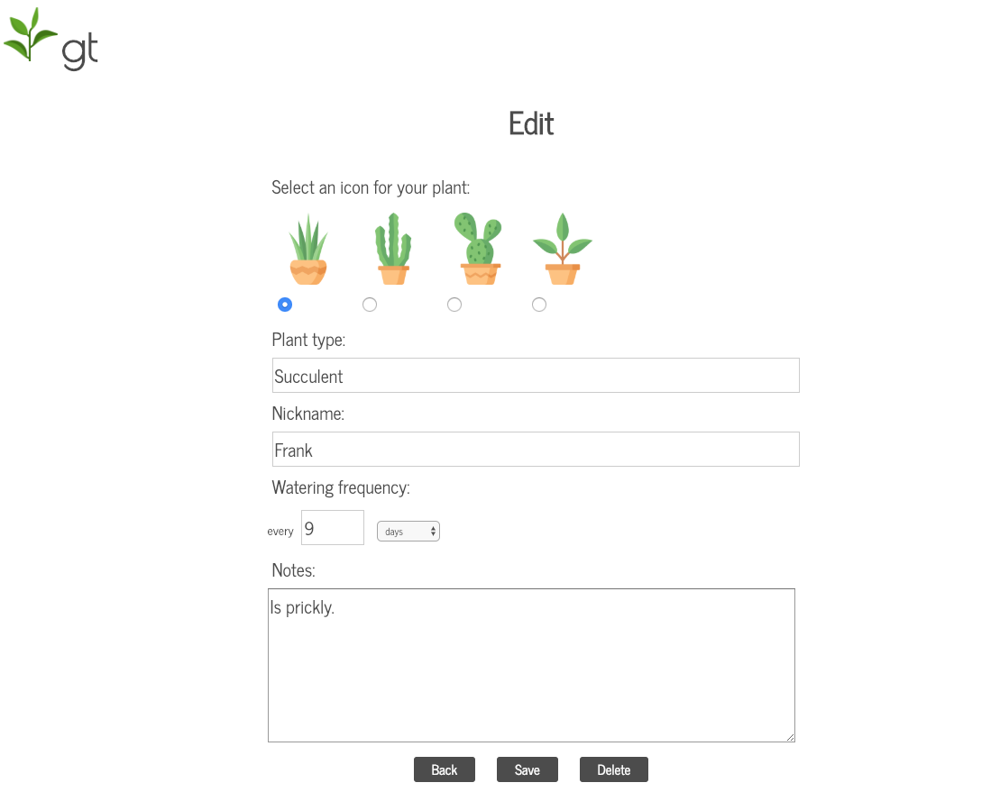

## Technical

Green Thumb was built with: 

**Front End**

* HTML5
* CSS3
* JavaScript 
* jQuery 

**Back End**

* Node.js 
* Express.js
* MongoDB
* Mongoose
* mLab database
* Mocha and Chai for testing

**Responsive**

This app is built to be responsive to smaller screen sizes using a media screen width breakpoint of 480px for smaller screen sizes. 

